## 1. Create a Git Repository

We will need a repository with the codebase for data modeling / data pipeline:

<table class="bdrless" style="border-width: 0px">
   <tr>
    <td><b>0.</b></td>
    <td>Create a new Repository in your personal GitHub account. Click the link here on the right, or go to GitHub to your repositories and click the green button "New". Call it something like "dbt_meteostat". For</td>
    <td><a href="https://github.com/new">Create a new GitHub Repo</a></td>
   </tr>
</table>

## 2. Setup dbt Cloud 

### dbt cloud account with initial configuration

<table class="bdrless" style="border-width: 0px">
   <tr>
    <td><b>1.</b></td>
    <td>Go to dbt cloud sign up page</td>
    <td><a href="https://www.getdbt.com/signup/">dbt cloud sign up page</a></td>
   </tr>
   <tr>
    <td><b>2.</b></td>
    <td>Provide all the information needed to create an account and click on <b>Create my account</b></td>
    <td><a href="./images/setup_2.png" target="_blank">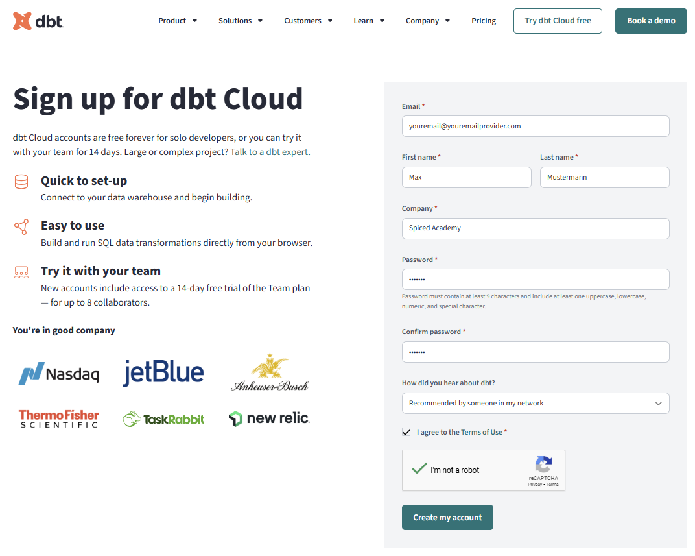</a></td>
   </tr>
   <tr>
    <td><b>3.</b></td>
    <td>Make sure you click on the verification email</td>
    <td><a href="./images/setup_3.png" target="_blank">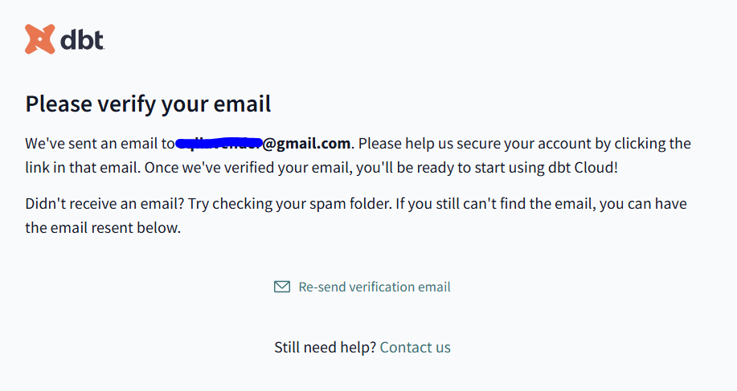</td>
   </tr>  
   <tr>
    <td><b>4.</b></td>
    <td>After that dbt is going to create a project and name it as `Analytics` </b> option</td>
    <td><a href="./images/setup_4.png" target="_blank">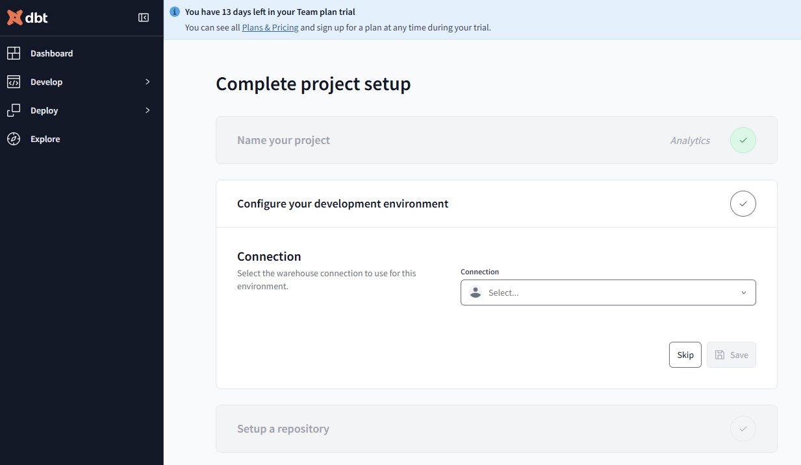</td>
   </tr>
   <tr>
    <td><b>5.</b></td>
    <td>Under the project setup we need to first configure our development environment and connect to our own databas</td>
    <td><a href="./images/setup_5.png" target="_blank">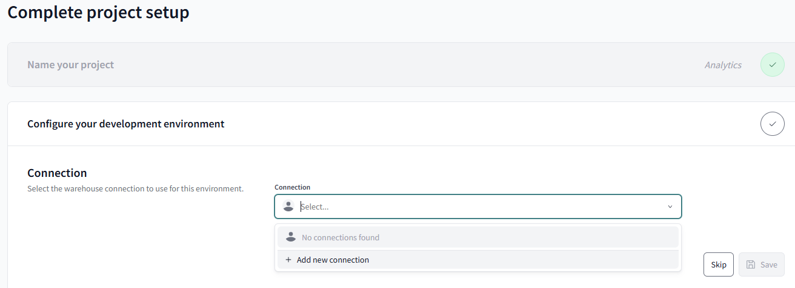</td>
   </tr>    
   <tr>
    <td><b>6.</b></td>
    <td>From the dropdown or from the panel please choose<b>PostgreSQL</b> and click on <b>Next</b></td>
    <td><a href="./images/setup_6.png" target="_blank">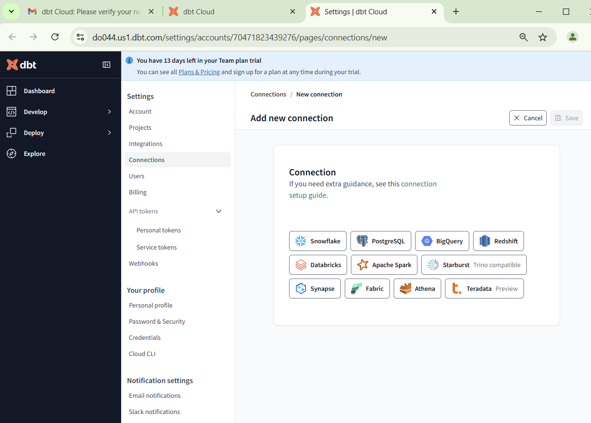</td>
   </tr> 
   <tr>
    <td><b>7.</b></td>
    <td>Provide the database credentials: host, port and database name (the database that we used during the sql module)</td>
    <td><a href="./images/setup_7.png" target="_blank">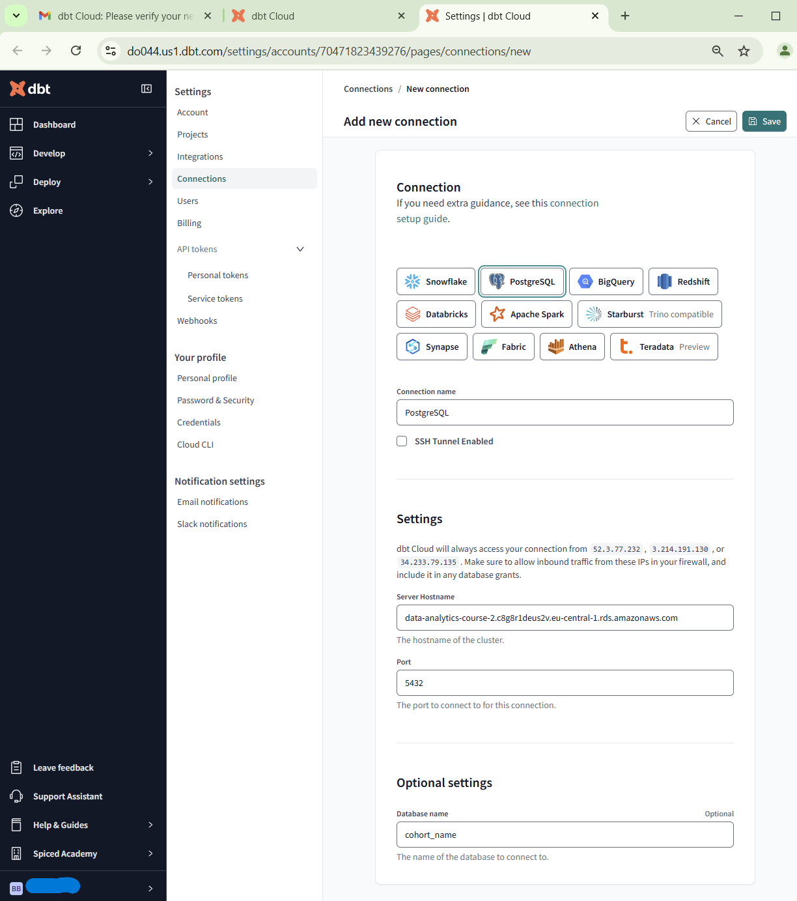</td>
   </tr> 
   <tr>
    <td><b>8.</b></td>
    <td>Please clik on credentials, name of your project(in my case Analytics) and then on configure development environment and add connection.</td>
    <td><a href="./images/setup_new1.png" target="_blank">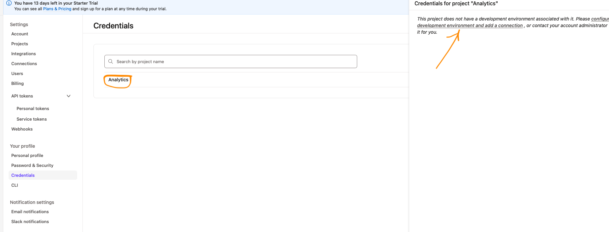</td>
   </tr>    
   <tr>
    <td><b>9.</b></td>
    <td>Under <b>Development Credentials</b> provide your credentials including username (which is given to you during the sql module), password to the instance and the schema(your own schema) that should be set to <b>public</b></td>
    <td><a href="./images/setup_8.png" target="_blank">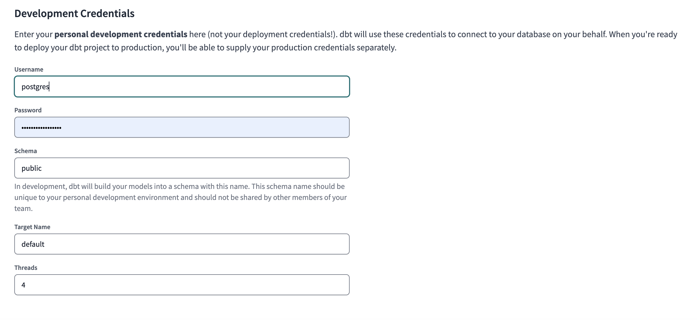</td>
   </tr>
   <tr>
    <td><b>10.</b></td>
    <td>Test your database connection!</td>
    <td><a href="./images/setup_9.png" target="_blank">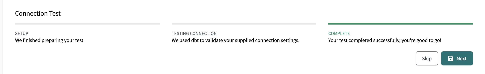</td>
   </tr>
   <tr>
    <td><b>11.</b></td>
    <td><b>Setup a repository:</b>  
    dbt can also get access to a github repo using ssh key
    <li>choose "Git Clone" option</li>   
    <li>follow the steps 11-15</li>
    </td>
    <td><a href="./images/setup_10.png" target="_blank">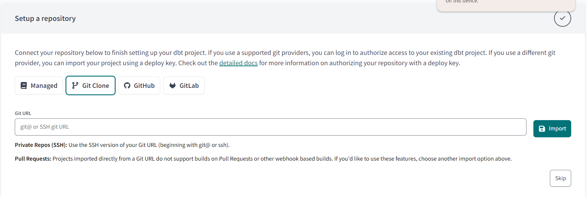</td>
   </tr>
   <tr>
    <td><b>12.</b></td>
    <td>Copy the ssh connection and the link taken from your repository (check it on github.com) under the <b>Code</b> button.</td>
    <td><a href="./images/setup_11.png" target="_blank">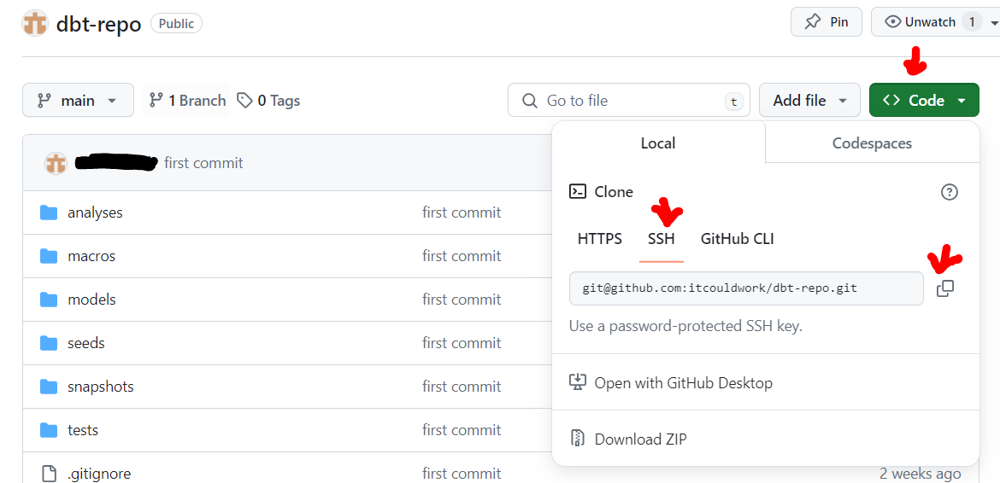</td>
   </tr>
   <tr>
    <td><b>13.</b></td>
    <td>Paste the link to dbt setup. It will generate an ssh key. You need to add to the repo on github.com.
    <li>Copy the ssh-rsa key</li>
    <li><a href="https://docs.getdbt.com/docs/cloud/git/import-a-project-by-git-url">tutorial</a></td>
    <td><a href="./images/setup_12.png" target="_blank">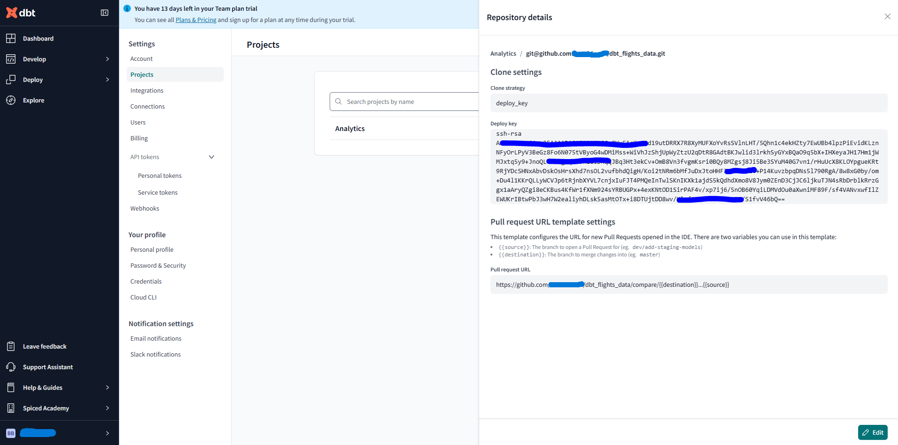</td>
   </tr>
   <tr>
    <td><b>14.</b></td>
    <td>In your GitHub:  
    - click on your image in the top right corner, choose <b>Settings</b> from the menu
    - from the menu on the left select <b>SSH and GPG keys</b>
    - click the green button "New SSH Key"
   </td>
    <td><a href="./images/setup_13.png" target="_blank">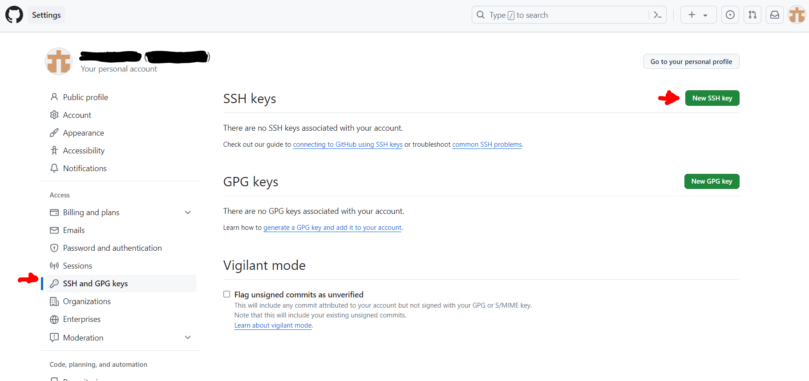</td>
   </tr>
   <tr>
    <td><b>15.</b></td>
    <td>In your GitHub:
    <ul>
      <li>Give the key a name(e.g. 'dbt-weather')</li>
      <li>paste the ssh key from dbt and save it</li>
      <li>a prompt will ask you to confirm with your GitHub password</li>
   </ul>
   </td>
    <td><a href="./images/setup_14.png" target="_blank">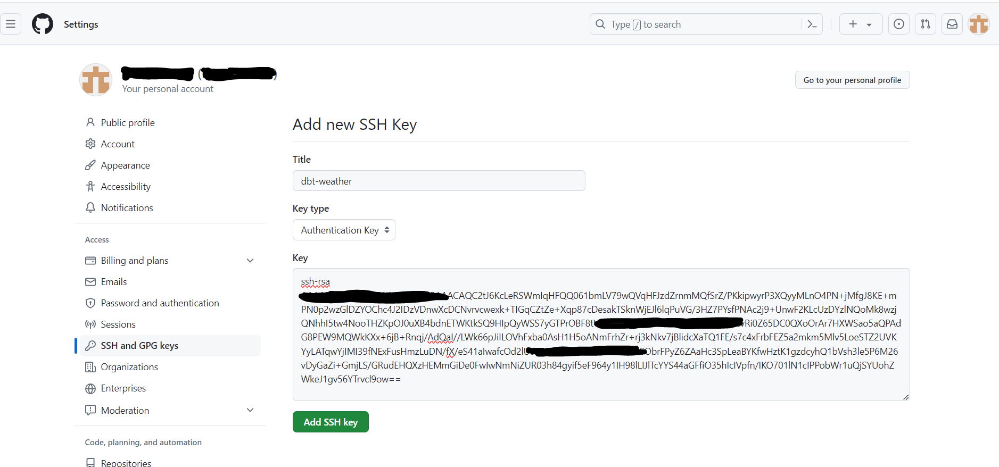</td>
   </tr>
   <tr>
    <td><b>16.</b></td>
    <td>In your GitHub: you should now see the ssh key
   </td>
    <td><a href="./images/setup_15.png" target="_blank">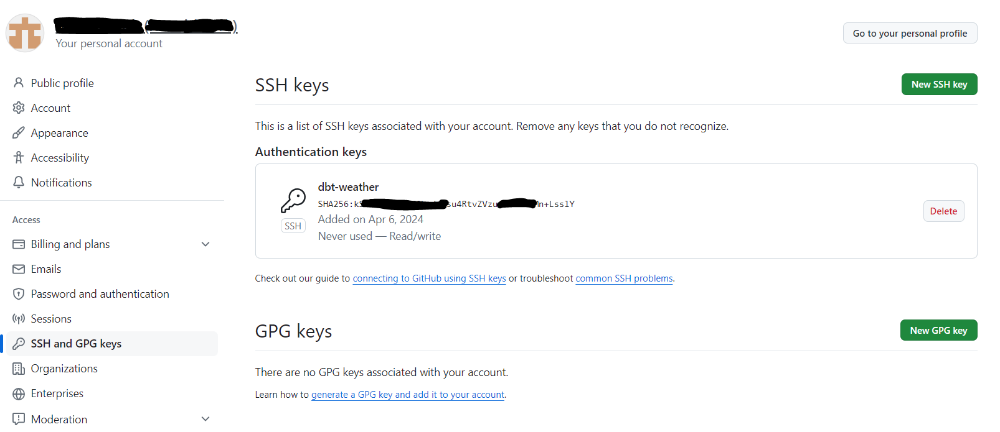</td>
   </tr>
   <tr>
    <td><b>17.</b></td>
    <td>Back to dbt repository setup. Click the Button "Next". If everything worked you might see a similar message...</td>
    <td><a href="./images/setup_16.png" target="_blank">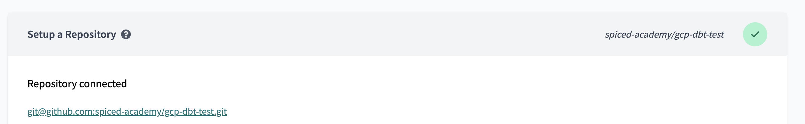</td>
   </tr>
   <tr>
    <td><b>18.</b></td>
    <td>... and your dbt project is ready!</td>
    <td><a href="./images/setup_17.png" target="_blank">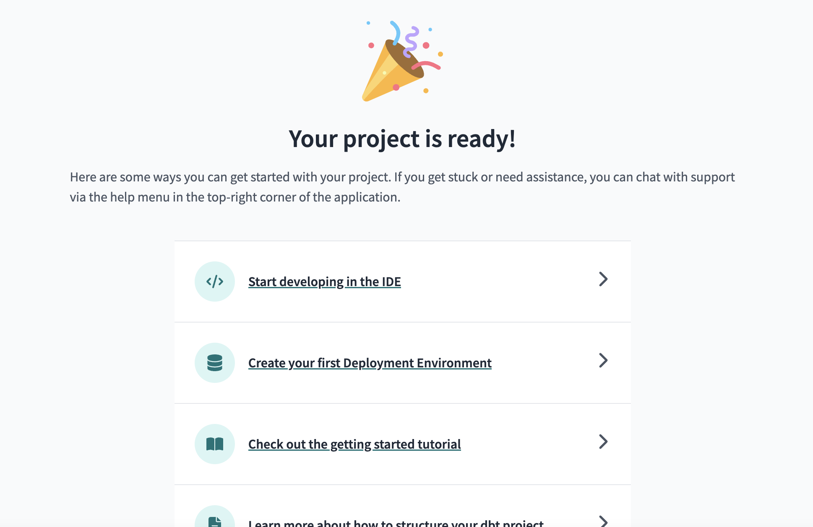</td>
   </tr>
   <tr>
    <td><b>19.</b></td>
    <td>On initial setup you will get a 14 day trial of the "Team" plan. As long as you don't enter any payment information, you can let the trial ruan out without any consequences. Even with the Team Trial you only can have one active dbt project, so there is no real benefit for our needs. At the end of the trial you can switch to the "Developer" plan. <b> 
    You can skip this step for now.</b>    
    Go to your <b>Account Settings</b> (using the icon in the top right corner) and go to the <b>Billing</b> section from the menu on the left side. Make sure you're using the developer plan which is free of charge and allows you to have one project at a time </td>
    <td><a href="./images/setup_18.png" target="_blank"></td>
   </tr>   
   <tr>
    <td><b>20.</b></td>
    <td>In the navigation bar go to <b>Initialize dbt project</b> It will create all the necessary folders. dbt will synchronise with GitHub and show the repo on the left under "File Explorer". Above that is the Version Control Section. <b>Note: We <u>don't need</u> to create a branch.</b></td>
    <td><a href="./images/setup_19.png" target="_blank">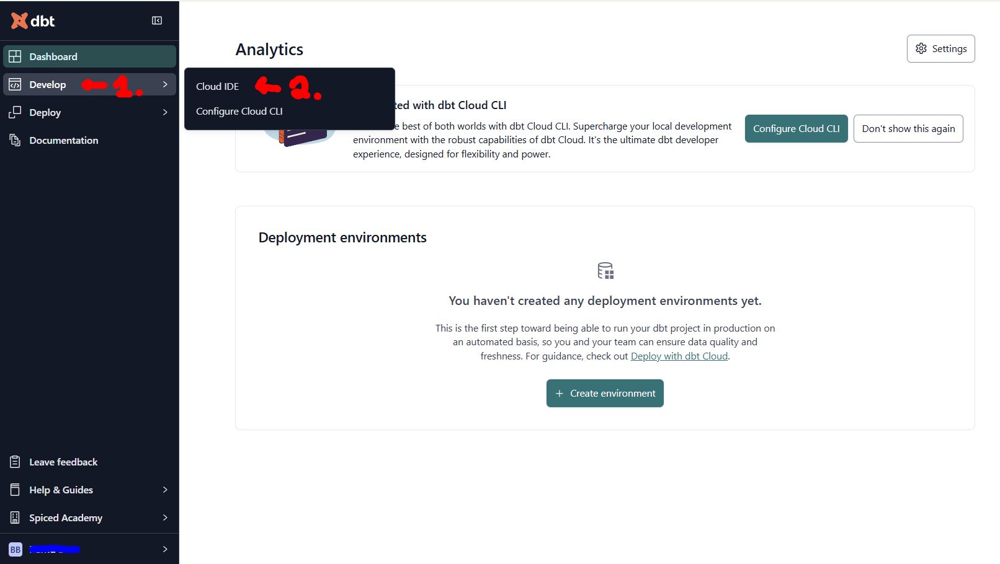</td>
   </tr>
      <tr>
    <td><b>21.</b></td>
    <td>If you forget to add SSH key it will give you the following error</td>
    <td><a href="./images/setup_20.png" target="_blank">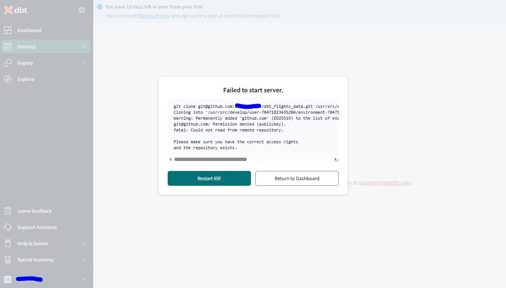</td>
   </tr>
</table>

### Reading

- [How to strucure a dbt project](https://docs.getdbt.com/guides/best-practices/how-we-structure/1-guide-overview)
- [About data transformations](https://www.getdbt.com/analytics-engineering/transformation/)
