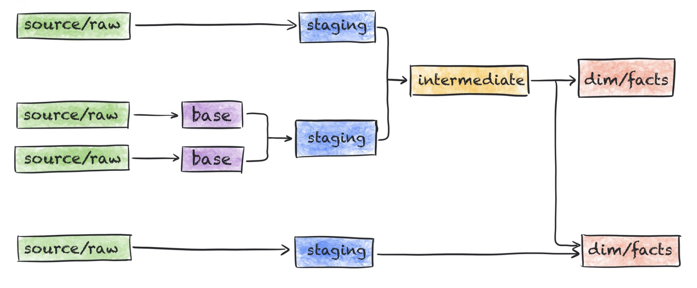

## 🎯 Objective
By the end of this walkthrough, you will:
- Set up a dbt project connected to the same database you have used for API ingestion.
- Define your first dbt_project.yml.

Connect the dots:

` API → Database → dbt Transformation → Visualization.`

---

## 🧩 1. Why dbt fits here

At this point, you have:
- Connected to the Weather API.
- Stored **RAW daily and hourly weather data** into the database.

You have worked directly with SQL to explore the JSON structure.  
Now we introduce **dbt** to help you manage, version, and organize these SQL transformations in a structured, reusable way.

---

## 🧱 2. dbt Layers Overview

Good model layers improve the usability and understandability of your `dbt` project and your data warehouse, and can make it easier to build off of and grow over time.




### Staging
- The **first main layer** in dbt.
- Does *very light transformations*: casting, renaming, filtering.  
- One model per raw source.

Example: `stg_weather_daily.sql` will flatten `weather_daily_raw`.
> We will add staging models to the folder **staging**

*<small>[dbt documentation: **Staging**](https://docs.getdbt.com/best-practices/how-we-structure/2-staging)</small>*


### Intermediate (prep)
- Applies business logic and joins staging models.  
- Used for reusable logic and aggregations.

> We will add intermediate models to the folder **prep**

*<small>[dbt documentation: **Intermediate**](https://docs.getdbt.com/best-practices/how-we-structure/3-intermediate)</small>*

### Marts (dim/fact)
- The analytical layer ready for BI tools (Tableau, Power BI, etc.).  
- Facts = events (like temperature readings).  
- Dimensions = entities (like stations or dates).


*<small>[dbt documentation: **Marts**](https://docs.getdbt.com/best-practices/how-we-structure/4-marts)</small>*

---
| Layer                          | Purpose                                      | What happens                                                                                        | Example                       |
| ------------------------------ | -------------------------------------------- | --------------------------------------------------------------------------------------------------- | ----------------------------- |
| **Staging**                    | Clean and flatten raw data                   | Renaming, type casting, filtering bad data, JSON flattening. 1:1 with source table. No major joins. | `stg_weather_daily`           |
| **Intermediate / Prep**        | Apply business logic, combine staging tables | Joins, feature engineering, aggregations, reusable logic                                            | `prep_weather_features`       |
| **Marts (Dimensions / Facts)** | Core business models for analytics           | Business-focused tables ready for dashboards                                                        | `dim_airport`, `fact_weather` |

## 2. Edit `dbt_project.yml`

Before creating any models, open `dbt_project.yml` and configure your folders and materializations:


<details>
  <summary>Click here: What is YAML</summary>

>YAML (short for “YAML Ain’t Markup Language”) is a human-readable data format used for configuration.

> .yml and .yaml are exactly the same—just two possible file extensions.

> .yml = shorter

> .yaml = more explicit

> DBT accepts both extensions, so your staging_source.yml is a valid YAML file.

</details>

-----

Edit the  `dbt_project.yml` 

```yaml
name: 'project' #<-- change this to dbt_meteostat

#DO NOT TOUCH THIS LEAVE IT AS IT IS
version: '1.0'
config-version: 2

profile: 'default'

model-paths: ["models"]
analysis-paths: ["analyses"]
test-paths: ["tests"]
seed-paths: ["seeds"]
macro-paths: ["macros"]
snapshot-paths: ["snapshots"]

target-path: "target"  
clean-targets:       
  - "target"
  - "dbt_packages"

#EDIT AND ADD THE FOLLOWING:

models:
  project:  #<--- CHANGE this to dbt_meteosat
    # Applies to all files under models/staging/
    staging:
      materialized: table # these could be views or even materialized views
    # Applies to all files under models/prep/
    prep:
      materialized: table
    # Applies to all files under models/mart/
    mart:
      materialized: table
```

