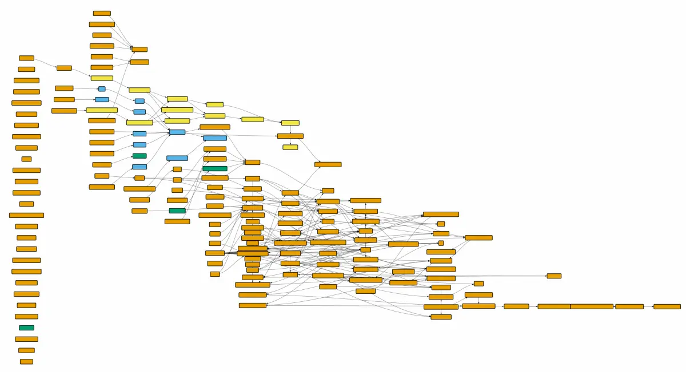

# Lesson A — Getting Started with  Staging Models

## Overview

In this lesson, you will learn how to:

1. Define sources and staging models.  
2. Flatten raw JSON weather data into a clean table for analysis.  
3. We will work with **daily weather data** only. You will then do the same for the hourly data.
4. You will create 2 more staging models from scratch as well.

---

## 1. Create the Staging Folder

1. Create a staging folder in models :`models/staging/`

2. Create a source file in the staging models: `staging_sources.yml`:

```yaml
version: 2

sources:
  - name: weather_data
    schema: public
    tables:
      - name: weather_daily_raw  # <--logical name used in the models
        identifier: weather_daily_raw # <-- actual physical table queried

      - name: weather_hourly_raw
        identifier: weather_hourly_raw

  - name: flights_data
    schema: public
    tables:
      - name: flights
        identifier: flights

      - name: airports
        identifier: airports

      - name: regions
        identifier: regions

# This is for documentation purposes, ALWAYS DOCUMENT!
models:
  - name: stg_weather_daily
    description: "Flattened daily weather data from the raw JSON source."
    columns:
      - name: airport_code
        description: "IATA airport code."
      - name: station_id
        description: "Weather station identifier."
      - name: date
        description: "Date of observation."
      - name: avg_temp_c
        description: "Average temperature (°C)."
      - name: precipitation_mm
        description: "Precipitation amount in millimeters."
```


## 🧮 2. Flattening JSON: Staging Daily Data

Let’s create a model in the staging folder `stg_weather_daily.sql`:

```sql
WITH daily_raw AS (
    SELECT airport_code,
           station_id,
           JSON_ARRAY_ELEMENTS(extracted_data -> 'data') AS json_data
    FROM weather_daily_raw
),
daily_flattened AS (
    SELECT airport_code,
           station_id,
           (json_data ->> 'date')::DATE AS date,
           (json_data ->> 'tavg')::NUMERIC AS avg_temp_c,
           (json_data ->> 'tmin')::NUMERIC AS min_temp_c,
           (json_data ->> 'tmax')::NUMERIC AS max_temp_c,
           (json_data ->> 'prcp')::NUMERIC AS precipitation_mm,
           (json_data ->> 'snow')::NUMERIC::INTEGER AS max_snow_mm,
           (json_data ->> 'wdir')::NUMERIC::INTEGER AS avg_wind_direction,
           (json_data ->> 'wspd')::NUMERIC AS avg_wind_speed,
           (json_data ->> 'wpgt')::NUMERIC AS avg_peakgust,
           (json_data ->> 'pres')::NUMERIC AS avg_pressure_hpa,
           (json_data ->> 'tsun')::NUMERIC::INTEGER AS sun_minutes
    FROM daily_raw
)
SELECT * FROM daily_flattened
```
#### Check for the CHANGES:
1. You can see the results by clicking the `Preview` button

2. Please make sure to save the file by clicking the `Save` button top right. Else you will not see the changes or results in Database

3. Go to DBeaver, refresh your tables. 
    - Do you see the table? 
    - Do you know what to look for?

4. Firstly the table will saved in the Database as the name of the model file i.e `stg_weather_daily` 

5. Please take a look at the DAG this is found in the `Lineage` option.
    - Does it look connected to anything else?
    - Should it be connected to some other table?
      - Yes! Remember the DAG shows us how the tables are dependent on one another making it easier to maintain.

6. Change the following code in line 5:

```sql
    FROM weather_daily_raw
```
**TO**
```sql
    FROM  {{ source('weather_data', 'weather_daily_raw') }}
```
> This is jinja {{ }} : this informs DBT that there is a dependence and helps build the DAG. Which will make your life easier later. See this DAG:


<details>
  <summary>READ MORE what JINJA really does</summary>

In DBT, when you define a source in a YAML file (like `staging_source.yml`) and then reference it in your models using `{{ source('source_name', 'table_name') }}`, you are **separating where the data comes from from what you do with it**.

**Without decoupling:**  
You might directly query `SELECT * FROM raw.weather_daily_raw` everywhere in your models.  
**Problem:** If the source table name or schema changes, you have to update every model manually.

**With decoupling using Jinja source:**  
You write:

```sql
SELECT * FROM {{ source('weather', 'weather_daily_raw') }} #the logical name 
```

Now, if the schema or table name changes i.e. `identifier` , you only update it in one place—the `staging_source.yml` .
Your transformations (staging, intermediate, marts) don’t need to change.

✅ Analogy: Think of it as having a “remote control” to point to your data, so your models don’t care where the data physically lives—they just trust the source definition.

</details> 

----


7. Check the DAG again, if not updated:
  - Save 
  - Update the Graph 

8. The table will only appear after doing the following:

  Run the model:

  ```bash
  dbt run --select stg_weather_daily
  ```

9. Make sure to refresh the Tables in your schema.

---

## 🧭 3. Try It Yourself

- Flatten the **hourly weather data** following the same pattern.  
- Add it as a second staging model (`stg_weather_hourly.sql`).  
- Note we do not need another source.yml file, since the one created earlier encompasses for every staging model i.e. daily and hourly. 

**Note:**
1. Save your files.
2. Run Preview to see the output of your query.
2. Execute `dbt run --select stg_weather_hourly`.
3. Refresh your schema in DBeaver check the results in the tables.

---
## TASK: Staging: Airports and Flights Data

In this section, you will create **staging models** for the airports and flights data. The goal is to practice enriching and preparing raw tables for later transformations, **without giving the full code** — you will think about the design and approach yourself.

**Note:**
1. Save your files 
2. Run Preview to see the output of your query
2. Execute `dbt run --select file_name_without_dot_sql`
3. Refresh your schema in DBeaver check the results


## 1. Airports Data

**Your task:**  
Create a staging model that **combines the `airports` table with the `regions` table**.
Name the staging model file `stg_airports.sql`

**PS**: In case you deleted your `regions` table, create it again in your schema and refer to that table and the given name

**Things to consider:**
- Which columns should you keep in the final table?  
- How should you handle columns with the same name in both tables?  
- What simple transformations can improve usability, e.g., renaming columns for clarity or casting data types?

<details> 
  <summary>Hint</summary>

  > **Hint**: Think about adding the region information to each airport by joining the two source tables.  
  > **Remember:** Staging models are for **light transformations only**. Avoid complex business logic here.
</details> 


---

## 2. Flights Data

**Your task:**  
Create a staging model for the flights table, name the staging model file `stg_flights_one_month.sql`

**Guidelines:**
- For development purposes, limit the dataset to **one month** to avoid processing millions of rows.  
- Decide **which month** to filter and how to implement the filter.  
- Ensure the model is clear and easy to use downstream.

### Using `{{ config(...) }}` in dbt

The `{{ config(...) }}` Jinja function lets you **override default materializations or other settings** for a specific model.

- By default, **staging models** are materialized as **tables** (as defined in `dbt_project.yml`).  
- You may want to materialize a model as a **view** when:
  - Working with **large datasets** in development  
  - You want to **save storage space**  
  - The model is an **intermediate step** only  

**Example usage:**
```sql
{{ config(materialized='view') }}
```

TASK: Override the `stg_flights_one_month.sql` such that is saved as a view.
Simply copy the config from the example and place it as the first line in the model file.


---

## 🧱 Summary

This notebook transitions you from direct SQL queries to structured, version-controlled transformations with dbt.  

You learn how **staging models** connect raw API data to analytical outputs, setting the foundation for future **intermediate** and **mart** layers.


----
# Solution

1. stg_weather_hourly

    <details> 
      <summary>Solution</summary>

      ```sql
      WITH hourly_raw AS (
          SELECT
                  airport_code,
                  station_id,
                  JSON_ARRAY_ELEMENTS(extracted_data -> 'data') AS json_data
          FROM {{source('weather_data', 'weather_hourly_raw')}}
      ),
      hourly_data AS (
          SELECT  
                  airport_code
                  ,station_id
                  ,(json_data->>'time')::TIMESTAMP AS timestamp	
                  ,(json_data->>'temp')::NUMERIC AS temp_c
                  ,(json_data->>'dwpt')::NUMERIC AS dewpoint_c
                  ,(json_data->>'rhum')::NUMERIC AS humidity_perc
                  ,(json_data->>'prcp')::NUMERIC AS precipitation_mm
                  ,(json_data->>'snow')::INTEGER AS snow_mm
                  ,((json_data->>'wdir')::NUMERIC)::INTEGER AS wind_direction
                  ,(json_data->>'wspd')::NUMERIC AS wind_speed_kmh
                  ,(json_data->>'wpgt')::NUMERIC AS wind_peakgust_kmh
                  ,(json_data->>'pres')::NUMERIC AS pressure_hpa 
                  ,(json_data->>'tsun')::INTEGER AS sun_minutes
                  ,(json_data->>'coco')::INTEGER AS condition_code
          FROM hourly_raw
      )
      SELECT * 
      FROM hourly_data
      ```
    </details> 


2. stg_airports

    <details> 
      <summary>Solution</summary>

      ```sql
    WITH airports_regions_join AS (
        SELECT * 
        FROM {{source('flights_data', 'airports')}}
        LEFT JOIN {{source('flights_data', 'regions')}}
        USING (country)
    )
    SELECT * FROM airports_regions_join
      ```
    </details> 

3. stg_flights_one_month

    <details> 
      <summary>Solution</summary>

      ```sql
          {{ config(materialized='view') }}

          WITH flights_one_month AS (
              SELECT * 
              FROM {{source('flights_data', 'flights')}}
              WHERE DATE_PART('month', flight_date) = 1 
          )
          SELECT * FROM flights_one_month
      ```
    </details> 